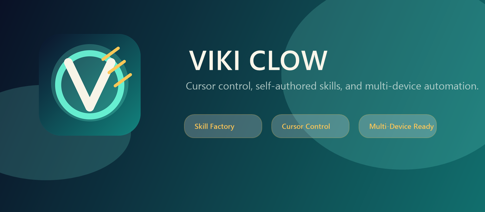

# VikiClow

<p align="center">
  
</p>

<p align="center">
  <strong>Execution-grade AI for real work.</strong><br>
  VikiClow turns intent into durable missions, routes work through swarms, proves what happened, and keeps improving the system it runs on.
</p>

<p align="center">
  <a href="https://github.com/rebootix-research/viki-clow/actions/workflows/ci.yml"></a>
  <a href="https://github.com/rebootix-research/viki-clow/actions/workflows/native-verification.yml"></a>
  <a href="https://github.com/rebootix-research/viki-clow/releases"></a>
  <a href="LICENSE"></a>
</p>

VikiClow is an operator system, not a chat wrapper.

It takes user intent, turns it into a mission, routes that mission through browser, shell, file, voice, memory, and verification surfaces, and writes the result back as evidence. When a task needs a capability that is not already present, Capability Foundry can discover, classify, sandbox, test, promote, and register a compatible one instead of stalling the mission.

## What VikiClow Is

VikiClow combines the parts that serious execution systems usually split across separate tools:

- a durable mission runtime with explicit terminal states
- Viki Browser for visible browser work with managed profiles and proof
- swarm-of-swarms orchestration with verifier and recovery routing
- a voice-native command center with mandatory readiness checks
- persistent memory that survives provider and model changes
- Capability Foundry for discovery, promotion, bundling, and routing of proven capabilities
- full PC and web execution surfaces instead of answer-only UX
- a self-evolution engine for candidate intake, experiments, promotion, and rollback

## Why It Feels Different

Most AI products still assume the conversation is the product.

VikiClow assumes the mission is the product.

- It keeps state instead of pretending every request starts from zero.
- It leaves artifacts and proofs instead of vague "done" messages.
- It treats failure, recovery, approval, and retry as first-class runtime states.
- It is designed to keep working even if you change providers, models, or auth paths.
- It can use browser, shell, file, channel, voice, and device surfaces as one system.

## Product Pillars

### Universal task execution

Intent becomes a mission record with plan, state, checkpoints, evidence, retries, and a terminal result.

### Viki Browser

VikiClow ships a branded browser surface with managed profiles, launcher packaging, browserd manifests, session vaults, evidence capture, and Playwright-compatible automation.

### Durable missions

Terminal states are explicit and inspectable:

- `completed`
- `failed`
- `blocked`
- `needs_approval`

### Swarm-of-swarms orchestration

A sovereign orchestrator routes domain swarms for browser work, coding, research, documents, local computer control, ops, and communication.

### Voice-native command center

Voice is not a plugin afterthought. Bootstrap, proof, and readiness are part of the setup path.

### Persistent memory

Mission writeback, Graphiti-style proof paths, and Neo4j-backed graph memory surfaces keep memory outside model context alone.

### Capability Foundry

Capability Foundry is Vikiclow’s controlled supply chain for new capability:

- discover curated sources and candidate integrations
- classify them as skills, plugins, MCP servers, repo integrations, or assets
- fetch or install them from approved sources
- sandbox and test them before promotion
- promote or reject them with recorded reasons
- bundle the winners into the shipped system
- register them into runtime routing so Vikiclow can choose the right capability for the task
- persist inventory, provenance, and usage knowledge so future missions learn from successful runs

Capability Foundry is exposed through the CLI, proof artifacts, the bundled capability inventory, and the runtime routing layer.

### Full PC and web execution

VikiClow can use Viki Browser, raw HTTP/web-fetch routes, local commands, file surfaces, device-linked actions, and channel-connected control.

### Self-evolution engine

Candidates can be ingested, benchmarked, promoted, and rolled back with provenance.

## Architecture

```text
User intent
  -> mission object
  -> sovereign orchestrator
  -> domain swarms
  -> browser / repo / research / local-computer executors
  -> verifier / recovery
  -> terminal state + evidence
  -> persistent memory writeback
```

```text
Capability Foundry
  -> discover curated sources
  -> classify and fetch candidates
  -> sandbox / test / score
  -> promote or reject
  -> bundle and register
  -> route at runtime
  -> remember success
```

## Install

### Recommended

```bash
npm install -g vikiclow@latest
vikiclow onboard --install-daemon
```

### From source

```bash
git clone https://github.com/rebootix-research/viki-clow.git
cd viki-clow
corepack enable
corepack pnpm install
corepack pnpm build
node .\vikiclow.mjs onboard --install-daemon
```

Windows operators should prefer WSL2 for day-to-day runtime work. Native PowerShell is supported for build, bootstrap, launcher, and proof flows, but the broader local automation stack is more reliable under WSL2.

## Quick Start

### 1. Bootstrap VikiClow

```bash
vikiclow onboard --install-daemon
```

This configures the workspace, gateway, bundled capabilities, browser runtime, Capability Foundry inventory, and mandatory voice readiness.

### 2. Start the runtime

```bash
vikiclow gateway --port 18789
```

### 3. Inspect the control surface

```bash
vikiclow dashboard --no-open
```

### 4. Verify the browser product

```bash
vikiclow browser package-native
vikiclow browser verify-native --json
```

### 5. Inspect and refresh capability inventory

```bash
vikiclow capabilities list
vikiclow capabilities discover "publish a browser workflow"
vikiclow capabilities fetch playwright browser_profiles
vikiclow capabilities bundle
vikiclow capabilities bootstrap
vikiclow capabilities plan "create a reusable automation skill"
corepack pnpm capabilities:proof
```

### 6. Run an end-to-end mission

```bash
vikiclow agent --message "Open the browser, collect release evidence, update the docs, and finish the work end to end."
```

## Reliability and Proof

VikiClow ships proof surfaces because execution claims are cheap without artifacts.

- release proof: `.artifacts/release-proof/`
- runtime stack proof: `.artifacts/runtime-stack-proof/`
- execution surface proof: `.artifacts/execution-surface/`
- Capability Foundry proof: `.artifacts/capability-bundle/`
- voice proof: `.artifacts/voice-proof/`
- browser proof: `~/.vikiclow/browserd/native-proof.json`
- mission backbone proof: `~/.vikiclow/missions/backbone/`
- graph memory proof: `~/.vikiclow/memory/graphiti/`

Use `corepack pnpm capabilities:proof` to regenerate the Capability Foundry proof bundle locally.

## Runtime Stack

For the strongest local runtime path supported directly by this repository:

```bash
corepack pnpm runtime:stack:up
corepack pnpm runtime:stack:proof
corepack pnpm runtime:stack:down
```

That flow validates the live Temporal-backed mission descriptor path and the live Neo4j-backed Graphiti proof path the repo can exercise locally.

## Execution Surfaces

VikiClow is intentionally broader than extension-style browsing:

- Viki Browser for visible browser sessions
- browserd manifests for profile/session/evidence verification
- raw web-fetch routes for lightweight HTTP extraction
- local command execution surfaces for controlled system work
- file writeback and workspace memory
- node/device-linked surfaces for screen, camera, audio, and paired-machine execution

## What Is Finished Today

This repo is already a serious operator system, not a demo shell:

- build and release proof are green
- browser launchers are shipped in `dist/`
- mission runtime and backbone proofs are real
- voice bootstrap is enforced in setup
- Capability Foundry ships with inventory, provenance, routing, and proof
- runtime stack proof exercises Temporal + Neo4j where Docker is available

What remains environment-dependent is equally explicit:

- a compiled native CEF browser app is not bundled in this repo build
- live LangGraph proof depends on a reachable endpoint
- native macOS and Android verification require host toolchains

## Why Teams Choose VikiClow

- They want execution, not demo conversation.
- They want durable state, not single-turn magic tricks.
- They want proof, memory, and repeatability.
- They want one system that can browse, control, verify, discover, and recover.

## Docs

- Docs hub: [https://docs.vikiclow.ai](https://docs.vikiclow.ai)
- Product vision: [VISION.md](VISION.md)
- Personal operator guide: [docs/start/vikiclow.md](docs/start/vikiclow.md)
- Capability Foundry guide: [docs/tools/vikiclow-skills.md](docs/tools/vikiclow-skills.md)
- CI and proof: [docs/ci.md](docs/ci.md)
- Install and update: [docs/install/updating.md](docs/install/updating.md)
- Browser surfaces: [docs/tools/browser.md](docs/tools/browser.md)

## License

MIT. See [LICENSE](LICENSE).
