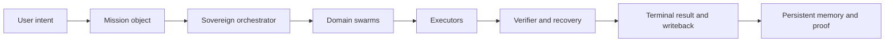

# VikiClow

VikiClow is an execution system.

It accepts intent, turns it into a mission, routes bounded swarms, executes through browser and local-computer surfaces, writes evidence, persists memory, and returns a real terminal state.

## Start here

<Columns>
  <Card title="Install VikiClow" href="/start/getting-started" icon="rocket">
    Go from zero to a running gateway, workspace, browser runtime, and mandatory voice bootstrap.
  </Card>
  <Card title="Run onboarding" href="/start/wizard" icon="sparkles">
    Use `vikiclow onboard` to configure auth, workspace, bundled capabilities, and service install.
  </Card>
  <Card title="Open the control surfaces" href="/web/control-ui" icon="layout-dashboard">
    Launch the dashboard, inspect missions, browser state, proofs, and runtime health.
  </Card>
</Columns>

## Core product layers

- Durable mission runtime with explicit terminal states
- Viki Browser with launcher packaging, profiles, and evidence capture
- Swarm-of-swarms orchestration with verifier and recovery routing
- Voice-native command-center readiness
- Graphiti-style persistent memory with Neo4j-backed proof paths
- Capability synthesis and provisioning
- Full PC and web execution surfaces
- Self-evolution ledgers for candidate intake, experiments, promotion, and rollback

## Why operators use it

- It is mission-first, not chat-first.
- It produces artifacts, not just messages.
- It survives provider and model changes.
- It can keep working when a single route fails by switching execution paths.

## Operator flow

## Core docs

<Columns>
  <Card title="Getting started" href="/start/getting-started" icon="play-circle">
    Install, onboard, and run the first real mission.
  </Card>
  <Card title="Viki Browser" href="/tools/browser" icon="globe">
    Profiles, automation, evidence capture, and browserd state.
  </Card>
  <Card title="Memory" href="/concepts/memory" icon="database">
    Durable memory, writeback, graph proof, and search.
  </Card>
  <Card title="Security" href="/gateway/security" icon="shield">
    Hardening guidance for real tool-enabled execution.
  </Card>
</Columns>
