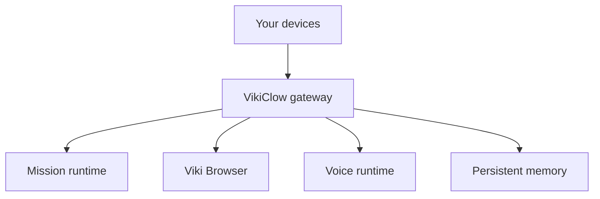

# Running VikiClow as your execution system

VikiClow is strongest when it is treated like an operator endpoint you own.

That means:

- one trusted operator boundary
- one durable workspace
- one visible browser runtime
- one memory backbone
- one bundled capability set that is ready before the first serious mission

## What VikiClow can do

VikiClow is built to execute, not only answer.

It can:

- browse with managed profiles and evidence capture
- run durable missions with explicit terminal states
- speak, transcribe, and keep voice readiness visible
- use local-computer and device-linked execution paths
- persist writeback and graph-style memory across runs

## Recommended operator shape



## Fast setup

### 1. Install and onboard

```bash
vikiclow onboard --install-daemon
```

That path now expects:

- bundled capability bootstrap
- mandatory voice readiness
- browser runtime support
- mission/memory state directories

### 2. Start the gateway

```bash
vikiclow gateway --port 18789
```

### 3. Verify the execution surfaces

```bash
vikiclow browser verify-native --json
vikiclow memory graphiti status
corepack pnpm execution:proof
```

### 4. Run a real mission

```bash
vikiclow agent --message "Open the release dashboard, verify the browser session, and finish the task end to end."
```

## Stronger local runtime

If you want the strongest local mission + memory path this repository can verify directly:

```bash
corepack pnpm runtime:stack:up
corepack pnpm runtime:stack:proof
corepack pnpm runtime:stack:down
```

That live proof exercises:

- Temporal-backed mission connectivity
- Neo4j-backed graph memory connectivity
- mission creation, completion, writeback, and graph-backed search

## Workspace model

By default the durable workspace lives under `~/.vikiclow/workspace`.

It is part of the runtime contract, not just prompt text:

- `AGENTS.md`
- `SOUL.md`
- `TOOLS.md`
- `HEARTBEAT.md`
- mission writeback under `memory/`

## Operational stance

Recommended defaults:

- keep tool access narrow until trust is established
- use approvals for high-impact actions
- inspect proofs and backbones, not just replies
- treat browser and memory artifacts as the real audit trail

## Next docs

- [Getting started](/start/getting-started)
- [Browser](/tools/browser)
- [Memory](/concepts/memory)
- [Security](/gateway/security)
